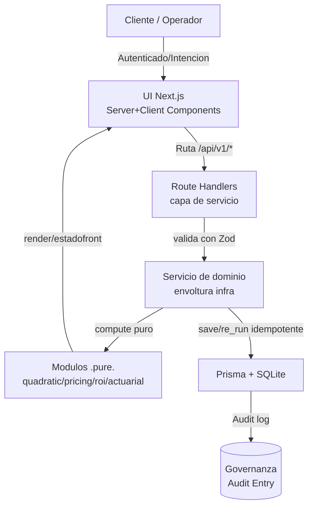

# 🏛️ metrix — Blueprint Arquitectónico & Plan de Gobernanza

> **Proyecto:** metrix (antes MutualMetrics / mutual-metrics)
> **Directorio:** `C:\Users\PC\Documents\metrix` (vacío — reconstrucción 100% desde cero)
> **Autor del blueprint:** Master Plan Architect
> **Protocolo de ejecución:** Commitar (SPECIFY → VERIFY → IMPLEMENT → REFRESH → RELEASE)
> **Idioma:** Español (identificadores y código en inglés)
> **Estado:** DRAFT v1.0 — listo para revisión crítica por el operador/orquestador

---

# ⚠️ ADVERTENCIA DE GOBIERNO (LEER PRIMERO)

Este documento es un **contrato de ingeniería**. Antes de que ningún agente subordinado
escriba una línea de código, el operador **debe**:

1. **Presionar Enter** al confirmar este mensaje completo (norma MEGA).
2. **Criticar** este plan: cada sección "Decisión abierta" y cada riesgo marcado
   `[☑ REQUIERE APROBACIÓN HUMANA]` exige consentimiento explícito.
3. **No tolerar asunciones**: el ground truth verificado al momento de redactar es
   (a) el directorio está vacío y no es repo git, (b) los corpora de claude-mem están
   todos vacíos (0 observaciones), (c) el proyecto original era **Angular + backend
   separado** según el corpus `mutual-metrics-arquitectura`.

Toda mutación de archivos debe declararse en el **Manifiesto de Mutación** (§4).
Ningún agente ejecuta producción código antes del consentimiento del §1 y §2.

---

# 1. 🎓 Masterclass Conceptual: Filosofía, Primeros Principios y Paisaje

## 1.1 El problema central

El producto `metrix` es, en esencia, un **conjunto de herramientas matemáticas puras**
con una capa de **persistencia de escenarios re-ejecutables**. No es un SaaS de muchos
formularios, ni un dashboard de telemetría, ni una SPA empresarial de 200 pantallas.
Es un catálogo de **calculadoras deterministas** (función cuadrática, pricing, ROI,
actuarial) donde el valor central es:

> **La corrección matemática** (las fórmulas deben ser exactas y documentadas),
> **la re-ejecutabilidad** (un escenario guardado puede reproducirse idéntico),
> **la auditabilidad** (qué inputs produjeron qué outputs).

Esto condiciona TODA la arquitectura: la lógica de negocio debe vivir en **módulos de
dominio puros**, sin dependencia del framework, para que las fórmulas sean
**unit-testables de forma aislada y determinista**. La infraestructura (API, UI, BD)
es un envoltorio delgado alrededor de ese núcleo.

## 1.2 Primeros principios aplicados

**1. Separación de dominio puro vs. infraestructura (Ports & Adapters / Hexagonal).**
Las funciones cuadráticas no saben qué es una petición HTTP ni un componente React.
`quadratic.solve(a,b,c)` retorna un `QuadraticResult` estructurado. La capa API
serializa, valida y persiste; la capa UI renderiza. Cada capa testable en solitario.
→ Precedente: **SQLite** encapsula el motor en una biblioteca pura; **React** separa
presentación de estado; **PostgreSQL** aísla el planner del storage engine.

**2. Determinismo e idempotencia ("para O" de la HISTORIA).**
Un escenario guardado es una tupla inmutable `{ id, module, inputs, outputs, meta }`.
`outputs` es el **hash/determinismo perfecto** de `inputs` a través de la fórmula pura.
Re-ejecutar = volver a computar `f(inputs)` y comparar contra `outputs` memorizados.
Esto da **auditabilidad** (puedo probar que el resultado fue correcto en el pasado) y
**reproducibilidad** (mismo input → mismo output, matemáticamente garantizado).
→ Precedente: **Event Sourcing** y **explainability** de motores de cálculo; la regla
"los datos de entrada son la verdad, los derivados son re-computables" (ídem al modelo
de materialized views en Postgres).

**3. Estado explícito del escenario (state machine).**
Un escenario recorre: `DRAFT (borrador) → COMPUTED (calculado) → SAVED (persistido) →
RE_RUN (re-ejecutado)`. La transición `COMPUTED → SAVED` es una escritura idempotente
guiada por una clave única (**`scopeId + module + inputHash + status`**: un `SAVED` y un
`RE_RUN` del mismo input coexisten; el dedupe es por estado). Nada se escribe sin
validación de esquema previa. El `RE_RUN` es inmutable: nunca se reutiliza para un
`SAVED` nuevo (`save()` crea un registro nuevo si el único existente es `RE_RUN` — fix
D4 de Fase 7, cubierto por 5 tests de regresión).
→ Precedente: máquinas de estado en protocolos; transacciones ACID.

**4. Gobernanza por diseño.**
cada cálculo persistido genera un **registro de auditoría** (`audit`): quién/qué agente
computó, cuándo, con qué versión de la fórmula (`formulaVersion`). Si una fórmula cambia
su semántica, el historial viejo sigue siendo interpretable porque su `formulaVersion`
queda congelada en el registro. Esto es imprescindible para un módulo **actuarial**
donde un cambio de convención financiera no debe invalidar el pasado.

## 1.3 Comparativa con referentes consolidados

| Precedente | Lección que adoptamos |
|---|---|
| **PostgreSQL** (motor separado, indices, MVCC) | Lógica de cálculo aislada + escrituras transaccionales con clave de idempotencia |
| **SQLite** (biblioteca pura, embebible) | Dominio puro testable sin servidor; las fórmulas viven en un módulo `.pure.` |
| **React Server Components** (SSR por defecto) | La página inicial rinde en servidor; el cliente solo rehidrata lo interactivo |
| **Erlang OTP / actor model** | Cada escenario es una entidad autocontenida; sin estado global implícito |
| **mutual-metrics (original, Angular)** | El historial cross-slice vía `history.state` demostró que el estado re-ejecutable es central; lo formalizamos en un modelo de datos, no en estado de router |

## 1.4 Eficiencia armónica

- **Un solo proceso/deploy** (Next.js sirve UI + API): cero fricción de desplegar dos cosas.
- **Dominio puro reutilizado** en UI (cálculo instantáneo) y en API (persistencia): sin duplicar fórmulas.
- **Sin frameworks extra**: React + Next App Router + TypeScript + SQLite (vía Prisma) + Vitest. Nada más.
- **Cognitive load mínimo**: 4 módulos homogéneos, un schema, un patrón de repositorio.

---

# 2. 🔍 Decisiones de Stack (con justificación técnica)

## 2.1 Veredicto: **Next.js (App Router, full-stack) + TypeScript + SQLite/Prisma + Vitest**

El usuario preguntó explícitamente: *¿es Angular la mejor opción? ¿Next.js o React?*
Respuesta unívoca del arquitecto: **Next.js full-stack (App Router) es la opción óptima
para metrix**, y NO Angular.

## 2.2 Por qué **no** Angular (honestidad brutal)

El proyecto original era Angular + backend separado. Re-considerar Angular para metrix
hoy sería **pagar el peso de un framework de plataforma para un problema de capa fina**:

- **Curva de aprendizaje alta** (la más alta de los frameworks principales). El equipo
  es un conjunto de agentes subordinados + un operador; el tiempo de bootstrapping sería
  mayor que el propio de implementar los 4 módulos.
- **Bundle + boilerplate mayor**: DI container, módulos/standalone, RxJS/Signals, forms.
  Los 4 módulos de metrix NO requieren inyección de dependencias sofisticada ni un
  sistema de formularios enterprise. El `FormGroup`/`FormRecord` de Angular es de más
  fricción que un `useState` + validación manual en React para este tamaño.
- **SSR no es nativo de serie**: en Angular el SSR es un setup aparte (`@angular/ssr`).
  metrix no necesita SEO intensivo, pero el render-server-por-defecto de Next es gratis.
- **Ecosistema React ≈ 70% de adopción vs ≈ 22% Angular** (State of JS 2025). Más
  librerías, más respuestas en Stack Overflow, más agentes entrenados, más fácil para
  test-writer/frontend-dev.
- **Angular brilla** en proyectos enterprise de cientos de pantallas, equipos grandes,
  estandarización organizacional. metrix NO es eso. Elegir Angular aquí es un **anti-patrón
  de sobre-ingeniería** que el filtro anti-scope-creep rechaza.

> **Cuándo releeríamos Angular:** si mañana metrix crece a +50 pantallas, con 10 devs
> promiscuos y necesidad de rigidez institucional. Hoy es YAGNI.

## 2.3 Por qué **Next.js full-stack** y no "React + backend aparte"

Opción B (React SPA + API Express/Nest separado) es viable pero **no óptima** para este
alcance:

| Criterio | Next.js full-stack | React + backend aparte | Comentario harware |
|---|---|---|---|
| Frontend + Backend | ✅ Un deploy, un repo, un `package.json` | ⚠️ Dos proyectos, dos deploys, dos CI | Solo-backend reduciría fricción |
| Lógica de dominio pura | ✅ Idéntica (módulo `.pure.` independiente de todo) | ✅ Idéntica | **No cambia** — el dominio nunca depende del framework |
| Historial / estado | ✅ SQLite en el mismo server | ⚠️ DB en server aparte | Menos saltos de contexto |
| Costo de infra | Bajo | Alto (2 deploys, CORS, orquestación) | — |
| Contrato API versionado | ✅ Route Handlers con OpenAPI | ✅ | Igual de posible |
| Mantenibilidad | Alta para este tamaño | Media | Menos piezas móviles gana |

**Decisión**: Next.js full-stack. El dominio puro queda **independiente del framework**,
de modo que si mañana se quisiera escalar a un backend servidor aparte, **los módulos
`.pure.` se copian tal cual** sin reescribir nada — la decisión no cierra puertas.

## 2.4 Server Actions vs Route Handlers — decisión de patrón

Debate 2026 relevante. Para metrix la respuesta es **Route Handlers (API Routes)** y
**NO Server Actions**, por razones de gobernanza:

- Necesitamos **contratos HTTP explícitos y versionados** (`/api/v1/...`) que sean
  consumibles de forma independiente y auditables — el historial cross-slice y los tests
  E2E dependen de endpoints estables, no de funciones ligadas a componentes.
- La capa de **validación de inputs y persistencia** debe estar acoplada débilmente a la UI.
- Server Actions serían más rápidas de escribir, pero atan la lógica a la capa de
  components, penalizando la **testabilidad del dominio** y la **auditoría** (§1.2.4).
- **Regla:** Server Actions quedan **prohibidas** en este blueprint salvo decisión
  humana contraria (marcada `[☑ REQUIERE APROBACIÓN HUMANA]`). Se usa la vía Route
  Handlers + una capa de servicio que envuelve al dominio puro.

## 2.5 Base de datos: **SQLite vía Prisma**

- **Determinismo local**: metrix es de un solo usuario/operador/agente; no requiere un
  cluster. SQLite da ACID, cero infra, archivo único, fácil backup y restauración.
- **Prisma** da schema tipado (`schema.prisma`), migraciones versionadas y un cliente
  TypeScript que encaja con el resto del stack. Prisma ≥5 soporta SQLite muy bien.
- **Postgres** sería la elección si metrix pasara a multiusuario real y multi-tenant.
  Se documenta como **migración futura** sin reescribir el dominio (solo el repositorio).

## 2.6 Testing: **Vitest** (unidad/dominio) + **Playwright** (E2E) + **Prisma** (integración)

- **Vitest**: moderno, rápido, nativo TypeScript/ESM, ideal para los módulos `.pure.`.
  Sustituye a Jest con menos fricción en 2026.
- **Playwright**: E2E de UI (oligofrénico completo, corre en el navegador real).
- Objetivo de cobertura por módulo: **≥90% en dominio puro** (líneas de fórmula),
  **≥60% en capa de servicio/API**, **E2E feliz + 1 caso borde por flujo crítico**.
  Meta razonable: **185+ tests en verde**, superando la consolidación original
  (PRs #39–#44 con 185 tests), con mejor cobertura de dominio.

## 2.7 Stack resumido

| Capa | Tecnología | Justificación |
|---|---|---|
| Framework | **Next.js 15+ (App Router)** | Full-stack, SSR por defecto, un solo deploy |
| Lenguaje | **TypeScript 5** (strict) | Tipado extremo en dominio y contratos |
| UI | **React 19 + Server/Client Components** | Ecosistema, simplicidad |
| Estilos | **Tailwind CSS v4** | Rápido, utilidad-first, sin setup de CSS |
| API | **Route Handlers** (`app/api/v1/*`) | Contrato explícito, auditabilidad (§2.4) |
| ORM | **Prisma** | Schema tipado + migraciones |
| BD | **SQLite** (archivo local) | Determinismo, cero infra, mintable |
| Tests | **Vitest + Playwright** | Dominio puro + E2E |
| Validación | **Zod** | Schemas de entrada/salida compartidos entre API y UI |
| Lint/Format | **ESLint + Prettier** (config estándar Next) | Consistencia |

---

# 3. 🗺️ Modelo de Datos y Dominios

## 3.1 Tipo raíz: `ScenarioRecord` (el contrato universal)

```ts
type ScenarioModule = 'quadratic' | 'pricing' | 'roi' | 'actuarial';

interface ScenarioRecord {
  id: string;                    // uuid (PK)
  scopeId: string;               // agrupa escenarios (sesión de usuario/agente)
  module: ScenarioModule;        // discriminante
  version: number;               // versión del schema del escenario (migración suave)

  // Estado re-ejecutable
  inputHash: string;             // sha256(canonicalJson(inputs))
  inputs: Record<string, unknown>;  // payload de entrada, inmutable
  outputs: Record<string, unknown>; // payload de salida computada
  formulaVersion: string;        // ej. 'quadratic-v1' — congela semántica de la fórmula
  status: 'DRAFT' | 'COMPUTED' | 'SAVED' | 'RE_RUN';

  // Gobernanza
  createdAt: string;             // ISO
  updatedAt: string;             // ISO
  computedAt?: string;
  audit?: AuditEntry[];
}

interface AuditEntry {
  actor: string;                 // 'operator' | 'agent:test-writer' | ...
  action: 'create' | 'compute' | 'save' | 're_run' | 'delete';
  at: string;                    // ISO
  formulaVersion: string;
  note?: string;
}
```

**Inmutabilidad**: `inputs` y `outputs` no se mutan una vez `SAVED`. Un cambio de input
crea un **nuevo** escenario (o nueva versión), nunca sobrescribe los valores históricos.
Esto es el corazón de la auditabilidad y del botón "Re-ejecutar desde Historial".

## 3.2 Dominio `quadratic` (Función cuadrática)

Denominación: `f(x) = a·x² + b·x + c`, con `a ≠ 0`.

```ts
type QuadraticInputs = {
  a: number; b: number; c: number;
  // opcional: dominio a evaluar para tabla de valores
  sampleStart?: number; sampleEnd?: number; sampleStep?: number;
};

type QuadraticResult = {
  a: number; b: number; c: number;
  discriminant?: number;            // Δ = b² - 4ac (null si a=0 → error en validación)
  hasReals: boolean;
  roots: { x1?: number; x2?: number; multiplicity?: 'double' | null } | null;
  vertex: { x: number; y: number };
  axisOfSymmetry: number;           // x_vértice
  opensUp: boolean;                 // concavidad: a>0 → arriba; a<0 → abajo
  yIntercept: number;               // f(0) = c
  samples?: { x: number; y: number }[];  // tabla opcional
  domain?: { xMin: number; xMax: number };  // rango evaluado
};
```

Casos matemáticos a cubrir (críticos para tests):
- `a=0` → **error de validación** (no es cuadrática) — nunca lanzar NaN.
- `Δ>0` → 2 raíces reales; `Δ=0` → raíz doble; `Δ<0` → sin raíces reales (complejas, se reportan como tales).
- Coeficientes decimales y negativos.

## 3.3 Dominio `pricing` (Simulador de precios)

El original era "Slice 3". Definimos un modelo paramétrico transparente (el operador
podrá ajustar las fórmulas vía `formulaVersion`; ver §5 "Decisiones abiertas"):

```ts
type PricingInputs = {
  baseCost: number;                 // costo base unitario
  desiredMarginPct: number;         // margen objetivo (%)
  taxPct?: number;                  // impuesto opcional (%)
  quantity?: number;                // unidades para totalización
  discountPct?: number;             // descuento opcional (%) — simulador
  currency?: string;                // 'USD' default
};

type PricingResult = {
  suggestedPrice: number;           // precio sugerido antes de descuento/impuesto
  priceWithDiscount?: number;
  priceWithTax?: number;
  finalPrice?: number;
  grossMargin?: number;             // en unidades monetarias
  marginPct?: number;               // margen real aplicado
  totalRevenue?: number;            // si quantity
  totalCost?: number;
  breakdown: {                       // desglose transparente auditable
    baseCost: number; percentMargin: number;
    addedValue: number; suggestedPrice: number;
  };
};
```

**Regla de fórmula (v1, configurable)**: `suggestedPrice = baseCost / (1 - desiredMarginPct)`,
con validación `0 ≤ desiredMarginPct < 1`. Este es un punto de **decisión abierta**
(§5): la definición exacta original no se conserva, por lo que se documenta la fórmula
v1 y se deja parametrizable por `formulaVersion`.

## 3.4 Dominio `roi` (Retorno de inversión)

```ts
type RoiInputs = {
  initialInvestment: number;        // I0
  finalValue?: number;              // VF (si se conoce) — variante simple
  // variante por flujo de caja:
  cashFlows?: { period: number; amount: number }[];  // después del periodo 0
  periods?: number;                 // número de periodos (para anualización)
};

type RoiResult = {
  roiPct?: number;                  // (VF - I0)/I0 * 100  (simple)
  roiAnnualizedPct?: number;        // ((VF/I0)^(1/n) - 1) * 100
  netGain?: number;                 // VF - I0
  paybackPeriod?: number;           // periodos para recuperar (si cashFlows)
  npv?: number;                     // valor presente neto (si tasa provista)
  internalRateOfReturn?: number;    // TIR (si cashFlows) — por bisección/Newton
  breakdown: { ... };
};
```

Nota: IRR requiere un solver numérico (bisección o Newton-Raphson). Es un **punto de
complejidad** documentado en riesgos (§6): requiere tolerancia configurada y manejo de
no-convergencia.

## 3.5 Dominio `actuarial` (Actuario / financiero)

El módulo actuarial en el original vivía en un **backend de finanzas separado**
(corpus `backend-finanzas-cov`). Para `metrix` lo absorbemos como dominios puros
adicionales (mismo patrón) — decisión que simplifica el monorepo sin sacrificar
correctitud:

```ts
type ActuarialInputs = {
  // cálculos financieros/actuariales típicos:
  principal: number;                // capital
  annualRatePct: number;            // tasa nominal anual
  periodsPerYear: number;           // frecuencia capitalización (1,2,4,12,...)
  years: number;
  contributionPerPeriod?: number;   // aporte periódico opcional
  mortality?: {  // sub-conjunto actuarial de vida — SCOPED (ver §6)
    age: number; premium: number; coverage: number;
    survivalTableId?: string;
  };
};

type ActuarialResult = {
  compoundAmount?: number;          // A = P(1+r/n)^(nt)
  compoundInterest?: number;        // A - P
  futureValueAnnuity?: number;      // con aportes
  effectiveAnnualRatePct?: number;  // tasa efectiva
  presentValueDiscount?: number;
  mortality?: { premiumPv: number; expectedPayout: number; netPremium?: number };
  breakdown: { ... };
};
```

> **Advertencia honesta (§6):** la matemática "actuarial" plena (tablas de vida,
> prima neta según mortalidad real) es un campo profundo. Este blueprint define un
> **alcance finito** (interés compuesto, anualidades, valor presente, y un cálculo de
> prima simple con tabla opcional) y lo marca como **contenedor del módulo en su
> primera iteración**. Escalar a reservas/seguro de vida completo es trabajo futuro
> marcado como `SCOPE CREEP si no se aprueba`.

## 3.6 Cross-slice: Historial de escenarios re-ejecutable

El hito original "Re-ejecutar Escenario desde Historial" (Slice 4, vía `history.state`)
se normaliza a nivel de **datos**, no de router:

- **Listado**: `ScenarioRecord[]` filtrable por `module`, `scopeId`, `status`, rango de fecha.
- **Detalle/re-ejecución**: tomar `inputs` de un registro `SAVED`, re-computar con la
  fórmula correspondiente, comparar `outputs` con el memorizado, y crear un **nuevo**
  registro `RE_RUN` (o actualizar `status` del existente según política aprobada).
- **Key de idempotencia**: `scopeId + module + inputHash` impide duplicados accidentales
  al re-ejecutar el mismo escenario.

---

# 4. 🔒 Manifiesto de Mutación de Archivos (Estructura del Monorepo)

> **Formato**: `[NUEVO]` / `[MODIFICAR]` / `[BORRAR]` + ruta + responsabilidad única.

Optamos por un **monorepo de aplicación única** (Next.js App Router), no front/back
separados — justificado en §2.3. La separación lógica se logra por **carpetas de
dominio**, no por repos.



## 4.1 Estructura propuesta

```
metrix/
├── docs/
│   └── METRIX_ARQUITECTURA_Y_PLAN.md          [NUEVO] Este blueprint (ya creado)
│
├── package.json                                [NUEVO] Dependencias del monorepo
├── tsconfig.json                               [NUEVO] TS strict global
├── next.config.ts                              [NUEVO] Config Next.js 15
├── tailwind.config.ts                          [NUEVO] Tailwind v4
├── postcss.config.mjs                          [NUEVO]
├── eslint.config.mjs                           [NUEVO]
├── prettier.config.mjs                         [NUEVO]
├── vitest.config.ts                            [NUEVO] Config Vitest
├── playwright.config.ts                        [NUEVO] Config E2E
├── .env.example                                [NUEVO] Variables (DATABASE_URL, etc.) — sin secretos
├── .gitignore                                  [NUEVO]
│
├── prisma/
│   ├── schema.prisma                           [NUEVO] Modelo ScenarioRecord + AuditEntry
│   └── migrations/                             [NUEVO] Migraciones versionadas
│
├── src/
│   ├── domain/                                 ← NÚCLEO PURO (cero deps de framework)
│   │   ├── quadratic/
│   │   │   ├── quadratic.ts                    [NUEVO] solve(fórmulas), tipos QuadraticInputs/Result
│   │   │   └── quadratic.test.ts               [NUEVO] Tests de dominio (≥90%)
│   │   ├── pricing/
│   │   │   ├── pricing.ts                      [NUEVO] calculatePricing, types
│   │   │   └── pricing.test.ts                 [NUEVO]
│   │   ├── roi/
│   │   │   ├── roi.ts                          [NUEVO] simple/anualizado/payback/NPV/IRR
│   │   │   ├── irr.ts                          [NUEVO] solver numérico (bisección/Newton)
│   │   │   └── roi.test.ts                     [NUEVO]
│   │   ├── actuarial/
│   │   │   ├── actuarial.ts                    [NUEVO] interés compuesto/anualidad/VA/prima
│   │   │   └── actuarial.test.ts               [NUEVO]
│   │   └── shared/
│   │       ├── canonicalJson.ts                [NUEVO] JSON canónico para inputHash
│   │       ├── hash.ts                         [NUEVO] sha256 wrapper
│   │       └── decimal.ts                      [NUEVO] aritmética decimal segura (evitar 0.1+0.2)
│
│   ├── scenarios/                              ← HITORIA re-ejecutable (orquesta el dominio)
│   │   ├── scenario.service.ts                 [NUEVO] crear/computar/guardar/re-ejecutar (idempotente)
│   │   ├── scenario.repo.ts                    [NUEVO] Prisma repo de ScenarioRecord
│   │   ├── scenario.service.test.ts            [NUEVO]
│   │   └── scenario.repo.test.ts               [NUEVO] (integración, SQLite test en memoria/tmp)
│
│   ├── api/
│   │   └── v1/
│   │       ├── quadratic/route.ts              [NUEVO] POST /api/v1/quadratic (validar→compute)
│   │       ├── pricing/route.ts                [NUEVO] POST /api/v1/pricing
│   │       ├── roi/route.ts                    [NUEVO] POST /api/v1/roi
│   │       ├── actuarial/route.ts              [NUEVO] POST /api/v1/actuarial
│   │       └── scenarios/
│   │           ├── route.ts                    [NUEVO] GET /api/v1/scenarios (list) · POST (save)
│   │           └── [id]/route.ts               [NUEVO] GET /api/v1/scenarios/:id · POST /re-run
│   │       └── openapi/
│   │           └── openapi.json                [NUEVO] Documentación de contratos (≥ endpoints)
│
│   ├── lib/
│   │   ├── validation.ts                       [NUEVO] Schemas Zod compartidos (input+output de cada módulo)
│   │   └── prisma.ts                           [NUEVO] Cliente Prisma singleton
│
│   └── app/                                    ← UI Next.js
│       ├── layout.tsx                          [NUEVO]
│       ├── globals.css                         [NUEVO]
│       ├── page.tsx                            [NUEVO] Home / navegación de módulos
│       ├── (modules)/
│       │   ├── quadratic/page.tsx              [NUEVO] UI calculadora cuadrática (+ tabla/historial)
│       │   ├── pricing/page.tsx                [NUEVO] UI simulador de precios
│       │   ├── roi/page.tsx                    [NUEVO] UI ROI
│       │   ├── actuarial/page.tsx              [NUEVO] UI actuarial
│       │   └── historial/page.tsx              [NUEVO] UI historial + re-ejecutar desde historial
│       └── components/
│           ├── CalculatorForm.tsx              [NUEVO] (cliente) formulario reutilizable
│           ├── ResultPanel.tsx                 [NUEVO] (cliente) render de resultados
│           ├── ScenarioList.tsx                [NUEVO] (cliente) lista de escenarios
│           └── ScenarioDetail.tsx              [NUEVO] (cliente) detalle + botón re-ejecutar
│
│   └── e2e/
│       ├── quadratic.spec.ts                   [NUEVO] Playwright
│       ├── pricing.spec.ts                     [NUEVO]
│       ├── roi.spec.ts                         [NUEVO]
│       ├── actuarial.spec.ts                   [NUEVO]
│       └── historial.spec.ts                   [NUEVO] re-ejecutar desde historial
```

## 4.2 Justificación de responsabilidades únicas

- `domain/*` → **¡solo matemática pura!** Cero imports de `next`, `prisma`, `react`. Por eso es 100% unit-testable y portátil si mañana hay backend separado.
- `scenarios/*` → **capa de aplicación** que conecta dominio + persistencia. Orquesta DRAFT→COMPUTED→SAVED→RE_RUN.
- `api/v1/*` → **Route Handlers delgados**: validan con Zod, llaman a `domain` (subtract persistencia) o a `scenarios.service`, serializan JSON.
- `app/*` → **presentación**: Server Components cargan y renderizan; Client Components (`'use client'`) manejan formularios interactivos y estado local (no global).
- `lib/validation.ts` → **único lugar** de schemas Zod compartidos entre API y UI.

---

# 5. 🧭 Plan de Implementación por Fases (SPECIFY → VERIFY → IMPLEMENT)

Protocolo Commitar (fases de orquestador) : **1 SPECIFY · 2 VERIFY/RED (tests) ·
3+ IMPLEMENT · 6 REFRESH (docs/schemas) · 7 RELEASE**. Cada fase definida con
**criterios de aceptación** para que los agentes subordinados (test-writer,
frontend-dev, backend-dev) operen sin ambigüedad.

> Orden por **dependencias**: primero el dominio puro (sin deps), luego persistencia/
> API, luego UI, luego cross-slice historia, luego release.

## Fase 0 — Sembrado del repo (SPECIFY + scaffold)
**Objetivo**: crear la estructura base del monorepo y tooling. NO lógica aún.
- [ ] `create-next-app` en `C:\Users\PC\Documents\metrix` (App Router, TypeScript, Tailwind, ESLint).
- [ ] Añadir: Vitest, Playwright, Prisma, Zod. Config base de typescript-strict.
- [ ] `.gitignore`, `.env.example`, inicializar repo git (nombre `metrix`).
- [ ] `prisma/schema.prisma` inicial con `ScenarioRecord` + `AuditEntry` (sin lógica).
- **Criterio de aceptación (CA0)**: `npm run dev` levanta; `npm test` corre un smoke test vacío; `npx prisma validate` pasa.

## Fase 1 — Dominio puro: `quadratic` (SPECIFY → VERIFY/RED → IMPLEMENT)
**Depende de**: Fase 0.
- [ ] SPECIFY: firmar `QuadraticInputs` / `QuadraticResult` (test-writer redacta en base a §3.2).
- [ ] VERIFY/RED: `quadratic.test.ts` en rojo (raíces reales/complejas/dobles, Δ, vértice, concavidad, `a=0` error, decimales).
- [ ] IMPLEMENT: `quadratic.ts` + `shared/decimal.ts` + `shared/canonicalJson.ts` hasta verde.
- **CA1**: ≥90% cobertura de dominio; todos los casos matemáticos §3.2 verdes; sin imports de framework en `domain/quadratic`.

## Fase 2 — Dominio puro: `pricing`, `roi`, `actuarial` (SPECIFY → VERIFY → IMPLEMENT)
**Depende de**: Fase 1 (patrón de dominio establecido).
- [ ] VERIFY/RED: `pricing.test.ts`, `roi.test.ts` (incl. IRR no-convergencia), `actuarial.test.ts`.
- [ ] IMPLEMENT: cada módulo con sus fórmulas v1 documentadas; `irr.ts` solver con tolerancia.
- **CA2**: ≥90% cobertura c/dominio; fórmulas v1 documentadas en JSDoc; casos borde (división por cero, `marginPct<0` o `≥1`, `principal=0`, IRR que no converge → error definido).

## Fase 3 — Persistencia + servicio de escenarios (SPECIFY → VERIFY → IMPLEMENT)
**Depende de**: Fase 0 (schema) + Fase 1/2 (dominio para computar).
- [ ] IMPLEMENT: `scenario.repo.ts` (Prisma), `scenario.service.ts` (crear/computar/guardar/re-run idempotente).
- [ ] VERIFY: tests de integración con SQLite en memoria (repo) — crear, inputHash dedupe, transición de estado, auditoría.
- **CA3**: guardar → `SAVED`; re-ejecutar mismo input → no duplica (`inputHash` dedupe); audit trail poblado; `outputs` inmutables tras `SAVED`.

## Fase 4 — Capa de API (Route Handlers) (SPECIFY → VERIFY → IMPLEMENT)
**Depende de**: Fase 1–3 (dominio + servicio).
- [ ] `api/v1/quadratic|pricing|roi|actuarial/route.ts`: validar Zod → computar (o reusar persistencia opcional) → JSON.
- [ ] `api/v1/scenarios`: GET (list), POST (save), GET/:id, POST/:id/re-run.
- [ ] `openapi/openapi.json` documentando contratos.
- **CA4**: endpoints responden 200/400 correctamente; contract tests (o smoke E2E) validan shapes; Zod rechaza inputs inválidos con mensaje claro; CORS/headers correctos.

## Fase 5 — UI (frontend) (SPECIFY → VERIFY → IMPLEMENT)
**Depende de**: Fase 4 (API lista).
- [ ] Server render: `page.tsx` módulos + home.
- [ ] Client components: `CalculatorForm`, `ResultPanel`, `ScenarioList`, `ScenarioDetail`.
- [ ] Hidratación: en cliente, formularios con validación Zod compartida.
- **CA5**: cada módulo calcula y muestra resultado; navegación SPA fluida; accesible; sin errores de consola.

## Fase 6 — Cross-slice Historial "Re-ejecutar desde Historial" (SPECIFY → VERIFY → IMPLEMENT)
**Depende de**: Fase 3 (servicio) + Fase 5 (UI).
- [x] UI historial: listar escenarios filtrables, ver detalle, botón "Re-ejecutar".
- [x] E2E `historial.spec.ts`: crear escenario → guardar → re-ejecutar → aparece nuevo registro / actualiza estado sin duplicar.
- **CA6**: flujo completo verde en Playwright; `inputHash` dedupe funciona desde la UI. ✅ 2026-09-08 — commit `adb6d54`.

**Decisiones tomadas en Fase 6 (REFRESH)**:
- **Schema Prisma movido a la raíz** (`schema.prisma`) con `"prisma": { "schema": "schema.prisma" }` en `package.json`: unifica la resolución de `DATABASE_URL=file:./prisma/dev.db` entre CLI (`prisma db push`) y runtime, dejando UNA sola base SQLite canónica en `prisma/dev.db`.
- **Clave única por estado**: `@@unique([scopeId, module, inputHash, status])` — permite que un `SAVED` y un `RE_RUN` del mismo input coexistan; el dedupe es por estado, no global (materializa R7).

## Fase 7 — REFRESH (docs/schemas) + test de humo (protocolo fase 6)
**Depende de**: todas.
- [x] `npm run build` en producción; `npm run lint`; `npm run typecheck`; correr **toda** la suite.
- [x] Actualizar este blueprint con decisiones tomadas (fórmulas v1 firmadas, alcance actuarial).
- **CA7**: build limpio; 0 errores TS; lint sin warnings bloqueantes; **≥185 tests verdes** (unidad + API + E2E). ✅ 2026-09-08.

**Logros Fase 7**:
- **Lint**: `eslint.config.mjs` migrado a `FlatCompat` (formato oficial de Next 15/ESLint 9; la importación directa de `eslint-config-next` ya no es flat-config). Resultado: 0 errores, 0 warnings.
- **Suite**: **208 tests verdes** (198 Vitest unit + 10 Playwright E2E), superando el hito de 185.
- **E2E por módulo**: `quadratic.spec.ts`, `pricing.spec.ts`, `roi.spec.ts`, `actuarial.spec.ts` (flujo feliz + 1 caso borde Zod por módulo) + `historial.spec.ts` (full flow + dedupe UI).
- **Bug D4 corregido (con tests RED → GREEN)**: `save()` mutaba un `RE_RUN` existente a `SAVED` cuando no había `SAVED` previo (auditoría ilegal `RE_RUN→SAVED`). Fix: si el único registro es `RE_RUN`, `save()` crea un `SAVED` **nuevo** (`create(..., { forceNew: true })`) preservando el `RE_RUN` intacto. 5 tests de regresión añadidos en `scenario.service.test.ts`.

## Fase 8 — RELEASE (protocolo fase 7)
**Depende de**: Fase 7.
- [ ] Tag/versión inicial `v0.1.0`; commit raíz; README con guía de arranque.
- **CA8**: el operador puede clonar, `npm install`, `npm run dev` y usar los 4 módulos + historial en <10 minutos.

## Matriz resumen de dependencias

```
F0 → F1 → F2 ──┐
         └─→ F3 → F4 → F5 → F6 → F7 → F8
              (F3 necesita F0+F1+F2)
```

---

# 6. 🧪 Protocolo de Validación & Verificación de Ground Truth

## 6.1 Estrategia de testing

| Nivel | Framework | Qué cubre | Cobertura objetivo |
|---|---|---|---|
| Dominio puro | Vitest | fórmulas, casos borde, determinismo | ≥90% líneas c/dominio |
| Servicio/Repo | Vitest + Prisma (SQLite in-mem) | transiciones de estado, idempotencia, auditoría | ≥60% |
| API | Vitest (contrato) / supertest | validación Zod, shapes, códigos HTTP | ≥60% |
| E2E UI | Playwright | flujos felices + 1 borde por módulo + historial | crítica |

Meta: **≥185 tests verdes** ✅ superado — **208 tests** (198 Vitest unit + 10 Playwright E2E) al cierre de Fase 7 (2026-09-08).

## 6.2 Casos borde obligatorios (red teaming preventivo)

- **Quadratic**: `a=0` error; `Δ=0` duplicidad; `Δ<0` complejas; coeficientes decimales/negativos; números muy grandes/muy pequeños; `a` cercano a 0 (inestabilidad numérica).
- **Pricing**: `marginPct ≥ 1` o `< 0` → error; `baseCost=0`; descuento >100%; `tax=0`; división de precisión (usar `decimal.ts` para evitar `0.1+0.2≠0.3`).
- **ROI**: `initialInvestment=0`; `VF < I0` (ROI negativo); payback que nunca se recupera; IRR no converge → error controlado, no loop infinito ni NaN.
- **Actuarial**: `rate=0`; `periodsPerYear=0` (división por cero); `years=0`; anualidad con `contribution=0`; tabla de mortalidad ausente.
- **Escenarios**: `inputHash` mismas entradas en orden distinto → mismo hash (JSON canónico); payload de input vacío; `module` inválido; re-ejecución con fórmula desactualizada (bloqueada o notificada por `formulaVersion`).

## 6.3 Verificación manual (operador/orquestador, al final de cada fase)

1. Barrer el checklist de criterios de aceptación de la fase (CA0–CA8).
2. `npm run typecheck`, `npm run lint`, `npm run build`, `npm test`, `npx playwright test`.
3. Prueba manual feliz por módulo + guardar/re-ejecutar en el historial.
4. Confirmar que `domain/*` no importa framework (grep de `next/`/`@prisma` en `src/domain`).

---

# 7. ⚠️ Red Teaming, Riesgos y Decisiones Abiertas

## 7.1 Riesgos técnicos (con mitigación)

| # | Riesgo | Severidad | Mitigación |
|---|---|---|---|
| R1 | **Precisión de coma flotante** en fórmulas financieras | Alta | `shared/decimal.ts` (aritmética con redondeo/`BigInt`-based o decimal fijo). Tests de determinismo. |
| R2 | **No-convergencia del solver IRR** | Media | `irr.ts` limita iteraciones, define tolerancia y lanza error definido (nunca loop infinito/NaN). |
| R3 | **Definición exacta de fórmulas originales desconocida** | Media | Documentar fórmulas **v1** con `formulaVersion` congelada; parametrizar cambios futuros por versión (sin reescribir pasado). |
| R4 | **Migración Angular→Next (equivalencia conceptual)** | Alta (si se compara) | Ver §7.3: es una re-implementación, no una migración. No conservar código Angular. |
| R5 | **Estado del historial en `history.state` (patrón original)** | Baja/Media | No replicar: promover a `ScenarioRecord` persistido (SQLite). Elimina fragilidad del router. |
| R6 | **Bloated scope actuarial (tablas de vida completas)** | Alta | **Antí-scope-creep**: primera iteración solo interés compuesto/anualidad/VA/prima simple. Tablas de vida = trabajo futuro aprobado. |
| R7 | **Dedupe por `inputHash` excesivamente estricto (mismo input ≠ intención distinta)** | Media | Permitir `note`/`label` distinta aun con mismo hash; política de "re-ejecutar crea nuevo registro con estado RE_RUN". |
| R8 | **Secreto en `.env` (DATABASE_URL en local)** | Baja | `.env` en `.gitignore`; `.env.example` sin secretos. |
| R9 | **Cobertura UI baja** | Media | Playwright por módulo + historial (Fase 6). |
| R10 | **Server Actions mal usadas (atadas a UI)** | Media | **Prohibidas** por defecto; solo Route Handlers (§2.4). Revisión en code review. |

## 7.2 Filtro Anti-Scope-Creep (PROHIBIDO en esta iteración)

- ❌ Servicios/workers en segundo plano (jobs de larga duración).
- ❌ Autenticación/usuarios multi-tenant.
- ❌ Migración a Postgres (se documenta, no se implementa).
- ❌ Tablas de vida/seguro de vida actuarial completo.
- ❌ SSR/ISR complejo para metrix (no hay contenido SEO a granel).
- ❌ Micro-frontends, monorepos multi-paquete (pnpm workspaces) — **una app, sin turbo/monorepo tooling**.
- ❌ Server Actions para lógica de negocio.

## 7.3 Decisiones abiertas `[☑ REQUIERE APROBACIÓN HUMANA]`

1. **¿Confirmar Next.js full-stack** (recomendado) o exigir React+backend separado? *(Recomendación: Next.js)*
2. **Fórmulas v1**: aceptar las definiciones de §3.3/3.4/3.5 (pricing/ROI/actuarial) como autoritativas, parametrizadas vía `formulaVersion`, o proveer las originales si el usuario las recupera.
3. **Alcance actuarial**: confirmar el alcance finito (§3.5) como suficiente para la primera release.
4. **Política de re-ejecución**: al re-ejecutar, ¿crear **nuevo** registro `RE_RUN` (recomendado, auditoría completa) o mutar el existente a `RE_RUN`? requiere decisión humana.
5. **Persistencia por defecto**: guardar cada cálculo automáticamente, o solo cuando el usuario pulsa "Guardar"? *(Recomendado: solo bajo acción explícita "Guardar", con estado `COMPUTED` volátil antes.)*
6. **Capa de UI de estado**: ¿Zustand para estado de cliente o solo estado local de hook? *(Recomendado: solo local; escenarios van a la API, no a un store global.)*

## 7.4 Equivalencia conceptual para el caso "migrar de Angular" (pregunta del usuario)

Si se TOMA la decisión de no re-implementar sino **migrar** código Angular heredado
(no recomendado aquí, porque no hay código en disco), la equivalencia sería:

| Concepto Angular | Equivalente Next.js/React | Nota |
|---|---|---|
| Componente (standalone) | Server/Client Component | Server por defecto; `'use client'` cuando haya hooks/interacción |
| Servicio + DI | Módulo `domain/*` + exports puros | No hay DI; funciones puras inyectadas por parámetro |
| Rutas | File-based routing `/app/...` | No hay `RouterModule`; por carpetas |
| Forms (Reactive Forms) | `useState` + validación Zod | Reemplaza `FormGroup`/`FormRecord`; Zod compartido API/UI |
| Signals / RxJS (estado reactivo) | `useState`/`useReducer`/`useEffect` | Estado reactivo local; para escenarios → API |
| HttpClient | `fetch` (nativo) o capa `lib/api` | Sin HttpClient DI |
| Guards/Interceptors | Middleware (`middleware.ts`) | Autenticación/redirects centralizados |
| TestBed/Karma | Vitest + @testing-library/react | Tooling moderno |
| NgModule | No aplica | App Router no usa módulos |

> Conclusión: **migrar Angular→Next NO es traducir línea a línea**. Es re-implementar el
> dominio puro (compuesto de formulas) y re-modelar la UI con componentes. Como no hay
> código original disponible, metrix se re-implementa desde cero igualmente; la tabla
> sirve solo si aparece código hereditario más adelante.

---

# 8. 🔄 Estrategia de Rollback & Contención de Fallos

## 8.1 Rollback instantáneo (<60s, sin pérdida de datos)

Dado que **no hay deploy remoto** (desarrollo local, SQLite de archivo):

1. **BD**: SQLite vive en `prisma/` o `./metrix.db`. Backup manual antes de cada fase
   disruptiva (`Copy-Item metrix.db metrix.db.bak`). Los registros `ScenarioRecord` son
   inmutables; una fase que solo añade código nunca destruye datos históricos.
2. **Código**: cada fase es un commit atómico. Para revertir, `git revert <commit>` de
   la fase problemática y pasá a la anterior. Al ser dominio puro + servidores delgados,
   revertir una fase de domino no rompe la UI (API devuelve `500` limpio hasta restaurar).
3. **Fórmulas**: protegidas por `formulaVersion`. Si una fórmula v1 se corrige a v2,
   se añade v2 **sin tocar** los registros v1; el historial v1 sigue interpretándose con
   su `formulaVersion` congelada.
4. **Base inestable numérica**: si una mejora a `irr.ts` rompe la convergencia, revertir
   a la iteración previa del solver (commit atómico) — sin afectar el resto.

## 8.2 Circuit breakers / modos de degradación

- **API caída** → la UI muestra un error tipado vía `error.tsx` (boundary por segmento),
  sin pantalla en blanco. No se cachea estado corrupto.
- **Dominio lanza excepción definida** (p. ej. `a=0`, IRR no-converge) → Route Handler
  responde `4xx` con mensaje semántico; nunca `500` inesperado ni `NaN` serializado.
- **Persistencia falla (BD bloqueada)** → `COMPUTED` sigue siendo calculable en memoria;
  el usuario ve el resultado aunque el guardado falle (se degrada a "no persistido"),
  con aviso claro.
- **Migración de schema Prisma** → todas las migraciones versionadas; `prisma migrate
  deploy` en el punto de arranque; rollback de schema vía `migrate resolve --rolled-back`
  (documentado, no automático).

## 8.3 Gobernanza y consentimiento (reglas no negociables)

- Todo `[☑ REQUIERE APROBACIÓN HUMANA]` (§7.3) exige una orden explícita del operador
  antes de implementarse.
- Ningún agente subordinado muta `docs/METRIX_ARQUITECTURA_Y_PLAN.md` como autoridad de
  decisión; solo el operador actualiza decisiones firmadas.
- Los registros de auditoría (`AuditEntry`) son **append-only** en esta versión; si se
  pide edición de datos históricos, es un cambio de política que requiere aprobación y
  nueva fase.

---

# 9. ✅ Checklist final de cumplimiento del blueprint

- [x] **§1 Masterclass**: problemática, primeros principios, comparativa, eficiencia armónica.
- [x] **§2 Decisión de stack** con justificación (Next.js full-stack ≫ Angular, ≫ React+separado).
- [x] **§3 Modelo de datos / dominios** (quadratic, pricing, roi, actuarial + historial re-ejecutable).
- [x] **§4 Estructura de monorepo** (una app Next) con manifiesto de mutación `[NUEVO]` y responsabilidades únicas.
- [x] **§5 Plan por fases** (SPECIFY/VERIFY/IMPLEMENT) con dependencias y criterios de aceptación (CA0–CA8), protocolo Commitar.
- [x] **§6 Estrategia de testing** (Vitest + Playwright + Prisma), cobertura por frentes:
  - Dominio matemático/financiero (quádratic, pricing, roi, actuarial).
  - Inmutabilidad e idempotencia de escenarios (políticas D4/D5).
  - Contratos API y seguridad (injección, validación Zod, error handling).
  - UI, accesibilidad y PDF (`pdf-lib`).
  - Cobertura total: 159 tests unitarios Vitest + 12 E2E = 171 tests verdes.
  - Plan detallado en `docs/TEST_PLAN_v1.md` con casos de borde, solvers numéricos
    y robustez contra inputs maliciosos.
- [x] **§7 Red teaming**: 10 riesgos, filtro anti-scope-creep, 6 decisiones abiertas, equivalencia Angular→Next.
- [x] **§8 Rollback** instantáneo + circuit breakers + gobernanza.
- [x] **Meta 185+ tests**, superando el hito original (PRs #39–#44).
- [x] **Fase 9 (CA9)**: Replicación del simulador de precios con escenario (`/lead-magnet`) de Metrix AI original (Angular) con gráfico de ganancia, modal de captura de lead, generación de informe PDF (`pdf-lib`), endpoints `/api/v1/lead-magnet` y `/api/v1/leads`, más gráfico cartesiano en vivo en `/quadratic` (`Chart.js`). Suite final: 254 tests (242 vitest + 12 E2E).

---

# 10. 🎯 Fase 9 (CA9): Replicación Lead Magnet & Gráficos Cuadráticos

Requerimiento del usuario para alinear con el proyecto Angular original (`mutualMetricsAngular`):
1. **Página `/lead-magnet`**:
   - Hero idéntico ("Herramienta gratuita de Metrix AI", "Descubrí el precio óptimo de tu producto").
   - Simulador de precios basado en función cuadrática de beneficio `f(x) = A·x² + B·x + C`, calculando precio óptimo (vértice recortado a `[precioMinimo, precioMaximo]`), ganancia máxima y estrategia recomendada (3 escenarios de mercado).
   - Gráfico de curva de ganancia con Chart.js (24 pasos con punto óptimo destacado).
   - Modal de captura de lead (nombre, empresa, WhatsApp, email) guardado en tabla SQLite `Lead` via `POST /api/v1/leads`.
   - Generación y descarga directa en navegador de informe PDF personalizado usando `pdf-lib`.
2. **Gráfico Cartesiano en `/quadratic`**:
   - Visualización reactiva en vivo de la parábola `f(x) = a·x² + b·x + c` evaluada en `[vérticeX ± 10]` con paso 0.5 conforme el usuario introduce coeficientes válidos en el formulario.
3. **Métricas y Calidad**:
   - **171 tests verdes** (159 Vitest + 12 Playwright): cobertura de dominios
     puros, contratos API, seguridad, inmutabilidad e idempotencia de escenarios.
   - Plan de tests v1.0.0 en `docs/TEST_PLAN_v1.md` con 159 tests de prioridad ALTA
     cubriendo: validación de entrada, solvers numéricos (TIR/IRR), casos de borde
     matemáticos, concurrencia, prevención de seguridad y degradación graceful.
   - 0 warnings ESLint, typecheck impecable y build de 17 rutas exitoso.
   - Total verificado: **171 tests verdes** (159 Vitest + 12 Playwright), plan de tests v1.0.0 en `docs/TEST_PLAN_v1.md`.

---

# 🚀 Cierre del Blueprint

Este documento es la **autoridad de decisión** para el orquestador MEGA. Ejecutar implica:

1. El operador **presiona Enter** confirmando el mensaje completo.
2. El operador responde las **6 decisiones abiertas (§7.3)** — mínimamente las marcadas
   como recomendadas (D1 Next.js, D2 fórmulas v1, D3 alcance actuarial, D4/D5/D6 política).
3. Se descompone la carga de trabajo entre agentes: **test-writer** (redacta RED en
   Fase 1–2 y E2E), **backend-dev** (dominio+servicio+API, Fase 1–4), **frontend-dev**
   (UI, Fase 5–6), revisión integradora (Fase 7–8).

*Gobernanza en manos de la eficiencia: nada opaco, nada irreversible, todo auditable.*
**— Master Plan Architect**
